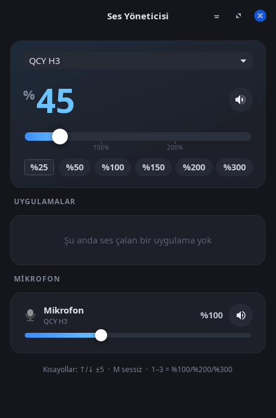

# Ses Yöneticisi

Linux masaüstü için sesi **%300'e kadar** yükseltebilen, sade ve koyu temalı bir ses kontrol uygulaması.
Varsayılan çıkış cihazını, çalan her uygulamayı ve mikrofonu tek pencereden yönetir; sistem tepsisinde çalışır.



## Özellikler

- **%0–%300 ana ses** — büyük yüzde göstergesi, %100 ve %200 işaretli kaydırıcı, hazır düğmeler (%25 / 50 / 100 / 150 / 200 / 300)
- **Seviyeye göre renk** — %100 üstünde turuncu, %200 üstünde kırmızı tema ve bozulma uyarısı
- **Çıkış cihazı seçimi** — hoparlör, HDMI, Bluetooth kulaklık vb. arasında geçiş; çalan sesler de yeni cihaza taşınır
- **Uygulama başına ses** — ses çalan her program için ayrı kaydırıcı (%300'e kadar) ve sessize alma
- **Mikrofon** — giriş seviyesi ve sessize alma
- **Canlı güncelleme** — ses başka bir yerden (klavye, başka bir mikser) değişirse arayüz anında yansıtır
- **Sistem tepsisi** — tıklayınca pencereyi aç/gizle, tekerlekle ±%5, sağ tık menüsü; pencere kapatılınca tepside çalışmaya devam eder
- **Tek örnek** — ikinci kez çalıştırıldığında yeni kopya açmaz, mevcut pencereyi öne getirir
- **Komut satırı** — klavye kısayollarına bağlanabilen `artir` / `azalt` / `sessiz` komutları

## Altyapı

| Katman | Kullanılan |
| --- | --- |
| Dil | Python 3 (tek dosya, harici Python bağımlılığı yok) |
| Arayüz | GTK 3, [PyGObject](https://pygobject.gnome.org/) üzerinden; özel CSS tema |
| Ses sunucusu | PipeWire (`pipewire-pulse`) veya PulseAudio |
| Ses kontrolü | `pactl` komutu (`pulseaudio-utils`) |
| Canlı olaylar | `pactl subscribe` arka plan iş parçacığında dinlenir, değişiklikler toplu halde yenilenir |
| Tepsi simgesi | `Gtk.StatusIcon` (XEmbed sistem tepsisi) |
| Masaüstü entegrasyonu | XDG `.desktop` dosyaları (uygulama menüsü ve otomatik başlatma) |

### Teknik notlar

- %100 üzeri ses, ses sunucusunun yazılımsal yükseltmesiyle elde edilir (`pactl set-sink-volume <cihaz> 250%`).
- `pactl -f json` çıktısı, Türkçe gibi ASCII dışı karakter içeren cihaz adlarında bozulduğu için uygulama `pactl list` metin çıktısını `LC_ALL=C` ile ayrıştırır.
- Kaydırıcı sürüklenirken `pactl` çağrıları ~35 ms aralıklarla sınırlanır; sürükleme sırasında ve hemen sonrasında dışarıdan gelen güncellemeler yok sayılır, böylece kaydırıcı "geri zıplamaz".
- Çok kanallı cihazlarda tüm kanallar aynı seviyeye ayarlanır (sağ/sol denge sıfırlanır).

## Gereksinimler

Debian / Ubuntu ve türevleri için:

```sh
sudo apt install python3-gi gir1.2-gtk-3.0 pulseaudio-utils
```

PipeWire kullanan sistemlerde `pipewire-pulse` kurulu olmalıdır (çoğu güncel dağıtımda varsayılan olarak gelir).

Tepsi simgesi için XEmbed sistem tepsisini destekleyen bir panel gerekir (XFCE, MATE, Cinnamon, LXDE/LXQt vb.).
GNOME'da tepsi simgesi bir eklenti olmadan görünmez; bu durumda pencere kapatıldığında uygulama tamamen kapanır.

## Kurulum

```sh
git clone https://github.com/msozturktr/ses-yoneticisi.git
cd ses-yoneticisi
./install.sh              # uygulama menüsüne ekler
./install.sh --otomatik   # ayrıca oturum açılınca tepside başlatır
```

Betik, uygulamayı `~/.local/bin/ses-yoneticisi` konumuna kopyalar ve `~/.local/share/applications` altına menü kaydı oluşturur. `sudo` gerektirmez.

Kaldırmak için:

```sh
./install.sh --kaldir
```

## Kullanım

Uygulama menüsünden **Ses Yöneticisi**'ni açın ya da terminalden çalıştırın:

```sh
ses-yoneticisi            # pencereyi aç (zaten çalışıyorsa öne getirir)
ses-yoneticisi --gizli    # yalnızca tepside başlat
```

### Pencere kısayolları

| Tuş | İşlev |
| --- | --- |
| `↑` / `→` / `+` | Sesi %5 artır |
| `↓` / `←` / `-` | Sesi %5 azalt |
| `M` | Sessize al / aç |
| `1` / `2` / `3` | %100 / %200 / %300 |
| `Esc` | Pencereyi tepsiye gizle |

### Komut satırı

```sh
ses-yoneticisi artir [N]   # varsayılan çıkışı N puan artır (varsayılan 5, en fazla 300)
ses-yoneticisi azalt [N]   # N puan azalt
ses-yoneticisi sessiz      # sessize al / aç
```

Bu komutlar klavyedeki ses tuşlarına bağlanarak tuşların da %300'e kadar çıkması sağlanabilir. XFCE örneği:

```sh
xfconf-query -c xfce4-keyboard-shortcuts -n -t string \
  -p "/commands/custom/XF86AudioRaiseVolume" -s "ses-yoneticisi artir 5"
xfconf-query -c xfce4-keyboard-shortcuts -n -t string \
  -p "/commands/custom/XF86AudioLowerVolume" -s "ses-yoneticisi azalt 5"
xfconf-query -c xfce4-keyboard-shortcuts -n -t string \
  -p "/commands/custom/XF86AudioMute" -s "ses-yoneticisi sessiz"
```

(Panelde PulseAudio eklentisi bu tuşları yakalıyorsa, eklentinin ayarlarından klavye kısayollarını kapatın.)

## Uyarı

%100 üzerindeki seviyeler sinyali yazılımla yükseltir. Yüksek seviyelerde ses kırpılabilir (cızırtı) ve
uzun süre yüksek seviyede çalmak hoparlörlere ya da işitmeye zarar verebilir. Dikkatli kullanın.

## Test edilen ortam

- Debian 13 (trixie), XFCE, X11
- PipeWire 1.4.5 + pipewire-pulse, pactl 17.0
- Python 3.13, GTK 3.24

## Lisans

[MIT](LICENSE)
