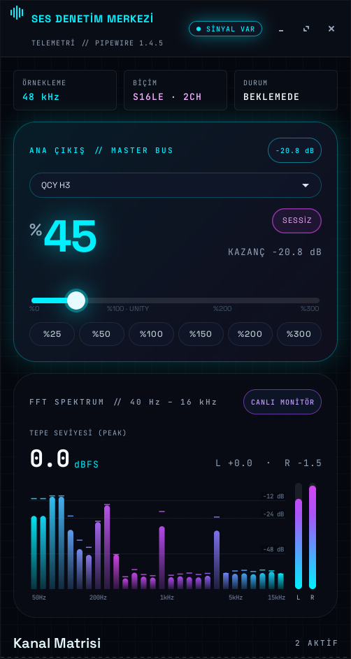
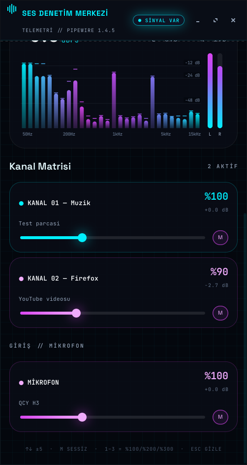

# Ses Yöneticisi

A volume control app for the Linux desktop that can boost the volume up to **300%**. It manages the default output device, every application that is playing audio, and the microphone from one window, and it stays in the system tray. It also has a real-time spectrum analyzer.

The interface uses a dark, neon style built around a "cybernetic audio HUD" design system. It has glass panels, cyan, magenta and violet accents, Space Grotesk headings and JetBrains Mono for numbers.

<p align="center">
  
  
</p>

> The interface text is in Turkish. ("Ses Yöneticisi" means "Sound Manager".)

## Features

- **Master volume from 0% to 300%.** The window shows the level as a large percentage and gives the gain in dB. The slider marks 100% as unity, and preset buttons jump to 25 / 50 / 100 / 150 / 200 / 300%.
- **Level-aware styling.** The master panel glows cyan up to 100%, violet above 100% and magenta above 200%, where it also warns that the sound may clip.
- **Output device selection.** You can switch between speakers, HDMI, Bluetooth headphones and other devices. Streams that are already playing move to the new device too.
- **Channel matrix.** Each application playing audio gets its own channel card with a slider that goes up to 300%, a dB readout and a mute button.
- **Microphone control.** Set the input level of the default source and mute it.
- **Live FFT spectrum.** 28 logarithmic bands from 40 Hz to 16 kHz show the audio playing on the current output device.
- **Peak meters.** Left and right peak meters show the level in dBFS, and a "signal / silence" indicator sits in the header.
- **Real telemetry.** The window shows the sample rate, sample format, channel count and state of the active output device, plus the sound server version.
- **Live sync.** When the volume changes somewhere else, such as from media keys or another mixer, the window updates right away.
- **System tray.** Click the icon to show or hide the window, scroll over it to change the volume by ±5%, or right-click it for a menu. Closing the window keeps the app running in the tray.
- **Single instance.** Launching the app a second time brings the existing window to the front instead of opening a new copy.
- **Command line.** The `artir`, `azalt` and `sessiz` commands raise, lower and mute the volume. You can bind them to keyboard shortcuts.

## Tech stack

| Layer | Used |
| --- | --- |
| Language | Python 3, in a single file with no pip dependencies |
| UI | GTK 3 through [PyGObject](https://pygobject.gnome.org/), with a custom CSS theme |
| Drawing | Cairo (pycairo) for the spectrum, meters and header icon |
| Sound server | PipeWire (`pipewire-pulse`) or PulseAudio |
| Volume control | `pactl` from `pulseaudio-utils` |
| Live events | `pactl subscribe` runs on a background thread, and changes are batched before the window refreshes |
| Audio capture | `parec` reads the output device's monitor source |
| Spectrum analysis | A pure-Python radix-2 FFT, with no NumPy needed |
| Tray icon | `Gtk.StatusIcon` (XEmbed system tray) |
| Fonts | [Space Grotesk](https://github.com/floriankarsten/space-grotesk) and [JetBrains Mono](https://github.com/JetBrains/JetBrainsMono), bundled under the SIL Open Font License |
| Desktop integration | XDG `.desktop` files for the application menu and autostart |

### Technical notes

- **Boost above 100%.** Levels above 100% use the sound server's software amplification, for example `pactl set-sink-volume <sink> 250%`.
- **dB values.** Software volume is cubic, so the app computes dB as `60 · log10(volume / 100)`. This matches the values `pactl` reports.
- **Output parsing.** `pactl -f json` breaks on non-ASCII device names, such as Turkish ones. The app therefore parses the plain `pactl list` text output under `LC_ALL=C`.
- **Spectrum pipeline.**
  - `parec` records the monitor of the default sink as 16-bit stereo at 48 kHz.
  - The app takes 2048-sample blocks and applies a Hann window.
  - It runs a real-input FFT by packing the samples into a 1024-point complex FFT, which gives a resolution of about 23 Hz.
  - It maps the results onto 28 log-spaced bands with a -72 dB floor.
- **CPU usage.**
  - The app analyzes about 12 blocks per second and redraws at 20 fps.
  - It skips the FFT and stops redrawing when the output is silent.
  - Capture and analysis run only while the window is visible.
- **Sliders.**
  - While you drag a slider, the app sends a `pactl` call at most every ~35 ms.
  - It ignores outside updates during and right after the drag, so the slider doesn't jump back.
  - The mouse wheel scrolls the page instead of changing a volume by accident.
- **Child processes.** The `pactl subscribe` and `parec` processes are tied to the app with `PR_SET_PDEATHSIG`, so they exit with it even after `kill -9`.
- **Channel balance.** On multi-channel devices, all channels are set to the same level, which resets any left/right balance.

## Requirements

On Debian, Ubuntu and their derivatives:

```sh
sudo apt install python3-gi python3-gi-cairo gir1.2-gtk-3.0 pulseaudio-utils
```

On PipeWire systems, `pipewire-pulse` must be installed. Most current distributions include it by default.

The tray icon needs a panel that supports the XEmbed system tray, such as XFCE, MATE, Cinnamon or LXDE/LXQt. On GNOME, the icon doesn't appear without an extension, so closing the window quits the app.

## Installation

```sh
git clone https://github.com/msozturktr/ses-yoneticisi.git
cd ses-yoneticisi
./install.sh              # install and add to the application menu
./install.sh --otomatik   # also start hidden in the tray at login
```

The script copies the app to `~/.local/bin/ses-yoneticisi` and installs the bundled fonts into `~/.local/share/fonts/ses-yoneticisi`. It also adds a menu entry under `~/.local/share/applications`. It doesn't need `sudo`.

To uninstall:

```sh
./install.sh --kaldir
```

## Usage

Open **Ses Yöneticisi** from the application menu, or run it from a terminal:

```sh
ses-yoneticisi            # open the window (or bring the running one to the front)
ses-yoneticisi --gizli    # start hidden in the tray
```

### Window shortcuts

| Key | Action |
| --- | --- |
| `↑` / `→` / `+` | Volume +5% |
| `↓` / `←` / `-` | Volume −5% |
| `M` | Mute / unmute |
| `1` / `2` / `3` | Set the volume to 100% / 200% / 300% |
| `Esc` | Hide the window to the tray |

### Command line

```sh
ses-yoneticisi artir [N]   # raise the default output by N points (default 5, max 300)
ses-yoneticisi azalt [N]   # lower it by N points
ses-yoneticisi sessiz      # toggle mute
```

You can bind these commands to the keyboard's volume keys so that the keys also go up to 300%. For example, on XFCE:

```sh
xfconf-query -c xfce4-keyboard-shortcuts -n -t string \
  -p "/commands/custom/XF86AudioRaiseVolume" -s "ses-yoneticisi artir 5"
xfconf-query -c xfce4-keyboard-shortcuts -n -t string \
  -p "/commands/custom/XF86AudioLowerVolume" -s "ses-yoneticisi azalt 5"
xfconf-query -c xfce4-keyboard-shortcuts -n -t string \
  -p "/commands/custom/XF86AudioMute" -s "ses-yoneticisi sessiz"
```

If a panel PulseAudio plugin already grabs these keys, turn off its keyboard shortcuts in the plugin settings.

## Warning

Levels above 100% amplify the signal in software. At high levels the audio can clip and distort. Playing at high levels for a long time can damage speakers or your hearing, so use the boost with care.

## Tested on

- Debian 13 (trixie), XFCE, X11
- PipeWire 1.4.5 with pipewire-pulse, pactl 17.0
- Python 3.13, GTK 3.24
- Intel Core i5-4260U, on which the analyzer uses about 2–4% of total CPU while the window is open

## License

The code is under the [MIT](LICENSE) license. The bundled fonts are under the SIL Open Font License 1.1 (see `fonts/OFL-*.txt`).
