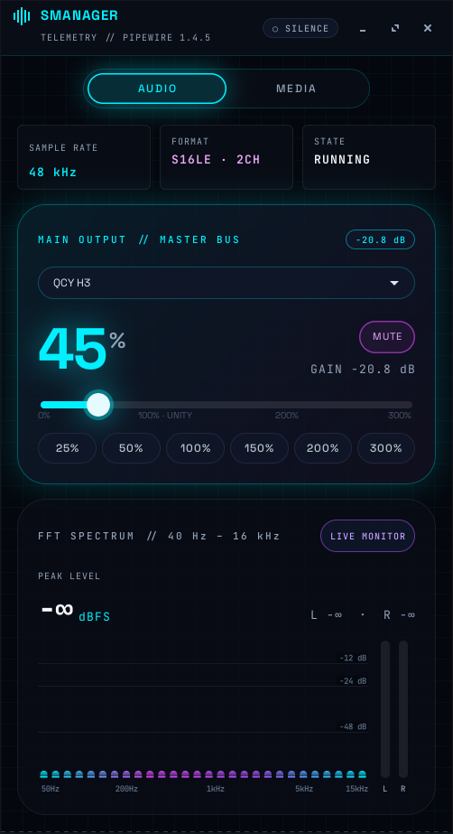
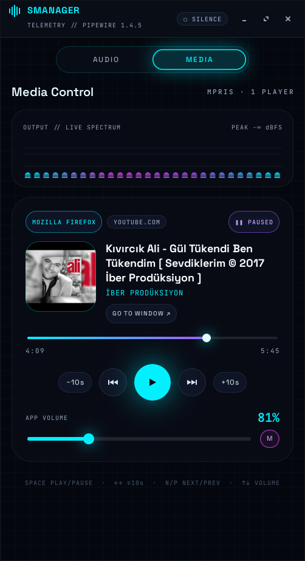

# smanager

A sound manager for the Linux desktop. It can boost the volume up to **300%**, control each application that is playing audio, and control the media playing in your browser or music player. It shows a real-time spectrum analyzer and runs in the system tray.

The interface is dark and neon-styled, with glass panels, cyan, magenta and violet accents, Space Grotesk headings and JetBrains Mono numbers.

<p align="center">
  
  
  
</p>

## Features

### Audio tab

- **Master volume from 0% to 300%.**
  - A large percentage readout shows the level, with the gain in dB next to it.
  - The slider marks 100% as unity.
  - Preset buttons set the volume to 25 / 50 / 100 / 150 / 200 / 300%.
- **Level-aware styling.** The master panel glows cyan up to 100% and violet above 100%. Above 200% it turns magenta and warns that the sound may clip.
- **Output device selection.** You can switch between speakers, HDMI, Bluetooth headphones and other devices. Streams that are already playing move to the new device too.
- **Channel matrix.** Every application playing audio gets its own channel card, with a slider up to 300%, a dB readout and a mute button.
- **Microphone control.** You can set the level of the default input and mute it.
- **Live FFT spectrum.** It has 28 logarithmic bands from 40 Hz to 16 kHz and shows the audio that is actually playing on the current output.
- **Peak meters.** Left and right peak meters show the level in dBFS, and a "signal / silence" indicator in the header shows whether anything is playing.
- **Real telemetry.** The tab shows the sample rate, sample format, channel count and state of the active output, plus the sound server version.

### Media tab

- **A card for each player.** Every media player that supports MPRIS gets a "now playing" card. This includes Firefox, Chrome and Chromium tabs, Spotify and VLC.
- **Track details.** Each card shows the player, the source site (for example YOUTUBE.COM), the playing or paused state, and the title, artist and album.
- **Cover art.** The card shows the player's own artwork when there is one. For YouTube videos without artwork, it shows the video thumbnail. Otherwise it shows a drawn placeholder.
- **Controls.** The card has previous, play/pause and next buttons, ±10 second skip buttons, and a "go to window" button that brings the browser or player to the front.
- **Progress bar.** It shows the elapsed and total time, and you can click or drag it to seek. It appears only when the player reports the track length.
- **App volume.** Each card has a 300% volume slider and a mute button for that player's own audio stream. The card finds the stream by process ID, or by application name when the IDs don't match.
- **Live spectrum strip.** A compact spectrum at the top of the tab shows the current output level.
- **Ordering.** The player that is playing moves to the top, and cards appear and disappear as players start and quit.

### Everywhere

- **Live sync.** When the volume, a device or a player changes anywhere else, the window updates right away.
- **System tray.**
  - Click the icon to show or hide the window.
  - Scroll over the icon to change the volume by ±5%.
  - Right-click it for a menu with play/pause for the current track, mute, reset to 100% and quit.
  - Closing the window keeps smanager running in the tray.
- **Single instance.** Launching smanager again brings the existing window to the front instead of opening a second copy.
- **Command line.** The `up`, `down` and `mute` commands can be bound to keyboard shortcuts.

## Tech stack

| Layer | Used |
| --- | --- |
| Language | Python 3 in a single file, with no pip dependencies |
| UI | GTK 3 through [PyGObject](https://pygobject.gnome.org/), with a custom CSS theme |
| Drawing | Cairo (pycairo) for the spectrum, meters, cover art and icons |
| Sound server | PipeWire (`pipewire-pulse`) or PulseAudio |
| Volume control | `pactl` from `pulseaudio-utils` |
| Live audio events | `pactl subscribe` on a background thread, with batched refreshes |
| Audio capture | `parec` reading the output device's monitor source |
| Spectrum analysis | A pure-Python radix-2 FFT, with no NumPy needed |
| Media control | [MPRIS](https://specifications.freedesktop.org/mpris-spec/latest/) over D-Bus, using Gio's `DBusProxy` and the `NameOwnerChanged` signal |
| Tray icon | `Gtk.StatusIcon` (XEmbed system tray) |
| Fonts | [Space Grotesk](https://github.com/floriankarsten/space-grotesk) and [JetBrains Mono](https://github.com/JetBrains/JetBrainsMono), bundled under the SIL Open Font License |
| Desktop integration | XDG `.desktop` files for the application menu and autostart |

### Technical notes

- **Boost above 100%.** smanager uses the sound server's software amplification, for example `pactl set-sink-volume <sink> 250%`.
- **dB values.** Software volume is cubic, so smanager computes dB as `60 · log10(volume / 100)`. This matches what `pactl` reports.
- **Output parsing.** `pactl -f json` breaks on non-ASCII device names, so smanager parses the plain `pactl list` output under `LC_ALL=C`.
- **Spectrum pipeline.**
  - `parec` records the default sink's monitor as 16-bit stereo at 48 kHz.
  - smanager splits the audio into 2048-sample blocks and applies a Hann window.
  - It runs a real-input FFT by packing the samples into a 1024-point complex FFT, which gives a resolution of about 23 Hz.
  - It maps the result onto 28 log-spaced bands with a -72 dB floor.
- **CPU usage.**
  - smanager analyzes about 12 blocks per second and redraws at 20 fps.
  - It skips the FFT and stops redrawing when the output is silent.
  - Capture runs only while the window is visible.
- **Media details.**
  - Between updates from the player, the playback position is extrapolated from the playback rate. It is re-synced from D-Bus every two seconds, after `Seeked` signals and after state changes.
  - Seeking uses `SetPosition` with the current `mpris:trackid`.
  - The ±10 s buttons use `Seek`.
- **Sliders.**
  - While you drag a slider, smanager sends a `pactl` call at most every ~35 ms.
  - It ignores outside updates during and right after the drag, so the slider doesn't jump back.
  - The mouse wheel scrolls the page instead of changing a volume by accident.
- **Child processes.** The `pactl subscribe` and `parec` processes are tied to smanager with `PR_SET_PDEATHSIG`, so they exit with it even after `kill -9`.
- **Channel balance.** On multi-channel devices, all channels are set to the same level, which resets any left/right balance.

## Requirements

You need:

- **Python 3** with **PyGObject** (GTK 3 bindings) and **pycairo**
- **GTK 3**
- **`pactl` and `parec`**, the PulseAudio client tools
- **PipeWire with its PulseAudio server** (`pipewire-pulse`), or plain PulseAudio

smanager has no pip dependencies, and it bundles its fonts.

## Installation

### 1. Install the dependencies

<details open>
<summary><b>Debian / Ubuntu / Linux Mint / Pop!_OS</b></summary>

```sh
sudo apt install git python3-gi python3-gi-cairo gir1.2-gtk-3.0 pulseaudio-utils
```

Current releases use PipeWire by default. If `pactl info` reports no server, install `pipewire-pulse` as well.

</details>

<details open>
<summary><b>Fedora</b></summary>

```sh
sudo dnf install git python3-gobject python3-cairo gtk3 pulseaudio-utils
```

Fedora ships PipeWire with `pipewire-pulseaudio` by default. On Fedora, `pulseaudio-utils` contains only the client tools (`pactl`, `parec`), not the PulseAudio server.

</details>

<details open>
<summary><b>Arch Linux / Manjaro / EndeavourOS</b></summary>

```sh
sudo pacman -S --needed git python-gobject python-cairo gtk3 libpulse pipewire-pulse
```

On Arch, `pactl` and `parec` come from the `libpulse` package. `pipewire-pulse` replaces the `pulseaudio` package. If you still use PulseAudio itself, leave `pipewire-pulse` out.

</details>

To check that the sound server is reachable, run `pactl info`. Its `Server Name` line should mention PipeWire or PulseAudio.

### 2. Install smanager

```sh
git clone https://github.com/msozturktr/smanager.git
cd smanager
./install.sh               # install and add to the application menu
./install.sh --autostart   # same, and also start hidden in the tray at login
```

The script works the same way on every distribution and doesn't need `sudo`. It does the following:

- copies smanager to `~/.local/bin/smanager`
- installs the bundled fonts into `~/.local/share/fonts/smanager`
- adds a menu entry under `~/.local/share/applications`
- with `--autostart`, adds a login entry under `~/.config/autostart`

Before it copies anything, the script checks the dependencies. If one is missing, it prints the exact `apt`, `dnf` or `pacman` command to install it.

If `~/.local/bin` isn't in your `PATH`, the script tells you. This can happen on some minimal Arch setups. Add the directory to your `PATH` to run `smanager` from a terminal. The menu entry works either way.

### Uninstall

```sh
./install.sh --uninstall
```

This removes the program, the menu and autostart entries, and the fonts.

### Desktop notes

- **System tray.** The tray icon uses the XEmbed system tray, so it needs an X11 session and a panel that supports XEmbed.
  - It works out of the box on XFCE, MATE, Cinnamon, LXDE/LXQt and Budgie.
  - On KDE Plasma, Plasma's XEmbed proxy shows the icon.
  - On GNOME, including Fedora Workstation, the icon only appears on X11 with the *AppIndicator and KStatusNotifierItem Support* extension.
  - On Wayland sessions, the tray icon isn't available, and closing the window quits smanager. Everything else works normally.
- **Media tab.** Firefox, Chrome and Chromium publish their media controls over MPRIS by default on Linux, and so do Spotify, VLC and most music players.

## Usage

Open **smanager** from the application menu, or run it from a terminal:

```sh
smanager            # open the window (or bring the running one to the front)
smanager --hidden   # start hidden in the tray
```

### Keyboard shortcuts

| Key | Action |
| --- | --- |
| `Tab` | Switch between the Audio and Media tabs |
| `↑` / `+` | Volume +5% |
| `↓` / `-` | Volume −5% |
| `M` | Mute / unmute |
| `1` / `2` / `3` | Set the volume to 100% / 200% / 300% |
| `Esc` | Hide the window to the tray |

On the Audio tab, `←` and `→` also change the volume by ±5%. On the Media tab, these keys act on the player that is playing, or on the first player if none is playing:

| Key | Action |
| --- | --- |
| `Space` | Play / pause |
| `←` / `→` | Seek −10 s / +10 s |
| `N` / `P` | Next / previous track |

### Command line

```sh
smanager up [N]     # raise the default output by N points (default 5, max 300)
smanager down [N]   # lower it by N points
smanager mute       # toggle mute
```

You can bind these commands to the keyboard's volume keys so that the keys also go up to 300%. For example, on XFCE:

```sh
xfconf-query -c xfce4-keyboard-shortcuts -n -t string \
  -p "/commands/custom/XF86AudioRaiseVolume" -s "smanager up 5"
xfconf-query -c xfce4-keyboard-shortcuts -n -t string \
  -p "/commands/custom/XF86AudioLowerVolume" -s "smanager down 5"
xfconf-query -c xfce4-keyboard-shortcuts -n -t string \
  -p "/commands/custom/XF86AudioMute" -s "smanager mute"
```

If a panel PulseAudio plugin already grabs these keys, turn off its keyboard shortcuts in the plugin settings.

## Privacy

For YouTube videos that have no cover art, smanager downloads the video thumbnail from `i.ytimg.com`. It makes no other network requests.

## Warning

Levels above 100% amplify the signal in software. At high levels the audio can clip and distort. Playing at high levels for a long time can damage speakers or your hearing, so use the boost with care.

## Tested on

- Debian 13 (trixie), XFCE, X11
- Fedora and Arch: not yet tested on a real system. Their package names were checked against the official Fedora and Arch repositories.
- PipeWire 1.4.5 with pipewire-pulse, pactl 17.0
- Python 3.13, GTK 3.24
- Firefox (YouTube) as an MPRIS player
- Intel Core i5-4260U, on which smanager uses about 2–4% of total CPU while the window is open

## Known limitations

- Firefox doesn't always report the track length for web media, and the progress bar is hidden while it is missing.
- The app volume on a media card controls every audio stream that belongs to that player's process.

## License

The code is under the [MIT](LICENSE) license. The bundled fonts are under the SIL Open Font License 1.1 (see `fonts/OFL-*.txt`).
